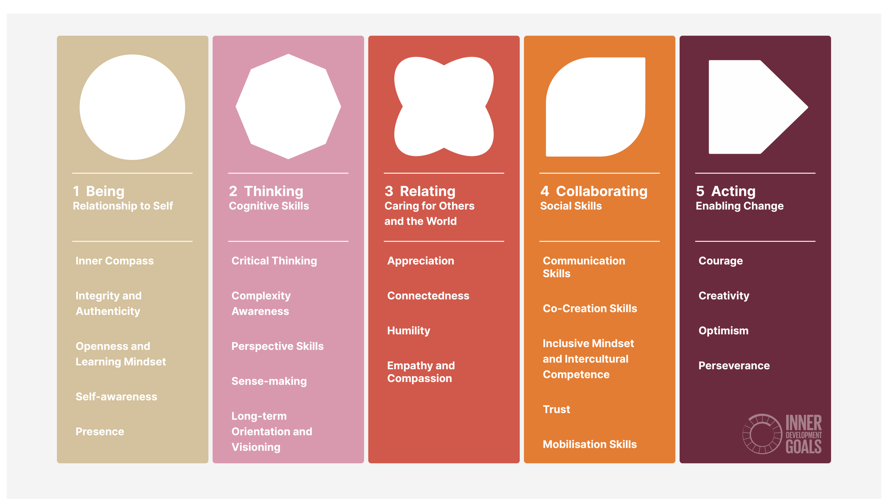

# Inner Development Goals

### What are the Inner Development Goals?

The Inner Development Goals (IDGs) are a framework of skills and qualities that aim to support personal growth and development in order to accelerate progress on global challenges like the UN Sustainable Development Goals.

<figure><figcaption>
Source: Inner Development Goals
</figcaption></figure>

### Philosophy and the Inner Development Goals

Using this as a framework for personal development, we explain how philosophy can help develop capabilities for each dimension of the Inner Development Goals.&#x20;

Being

The "Being" dimension focuses on cultivating our inner life and developing our relationship to our thoughts, feelings, and the body. Philosophical practices like self-reflection and contemplation could support the development of these capacities through increasing self-awareness and clarity.

Thinking

The "Thinking" dimension is about developing cognitive skills and making sense of the world as an interconnected whole. Philosophical inquiry, [critical thinking](../../../tools/critical-reasoning/) and exploring different worldviews aligns with enhancing these thinking skills.

Relating

The "Relating" dimension is about developing our capacity to care for others and the world. Attitudes that are essential to philosophical practice such as curiosity and intellectual humility allow us to empathise with others better.&#x20;

Collaborating

The "Collaborating" dimension is about being able to effectively working with others to create change. Philosophical skills like critical thinking often enable us to communicate effectively by being able to clearly express our thoughts and intentions.&#x20;

Also, being able to relate to others better through humility and perspective-taking also lead to effective collaboration.

Acting

The "Acting" dimension is about cultivating attitudes and mindsets that enable one to drive change. Philosophical concepts (such as Stoic ethics) from various traditions can offer insights that can help guide how one should act in a given situation or context.

One example that aligns with the IDG Acting qualities of courage is Stoic philosophy. Stoicism emphasizes developing the mental fortitude and courage to face life's challenges head-on. It teaches that we should embrace difficulties as opportunities for growth and maintain an unwavering belief in our goals despite setbacks.&#x20;

By developing capacities for critical thinking, self-reflection, perspective-taking and humility,  philosophical practice provides a wide array of insights and tools for inner development and personal growth.
